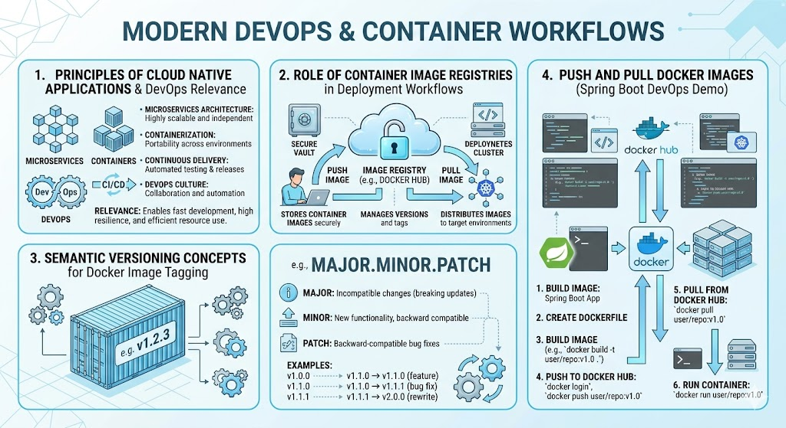

# [4.5] Cloud Native Application - Remote Containerization

## Lesson Overview

## Dependencies
- [Self Studies](./studies.md)
- [Lesson](./lesson.md)
- [Assignment](./assignment.md)

## Lesson Objectives
* **Explain** the principles of Cloud Native Applications and their relevance in modern DevOps practices
* **Identify** the role of container image registries in container-based deployment workflows
* **Apply** semantic versioning concepts when tagging Docker images
* **Push and pull** Docker images to and from Docker Hub using a Spring Boot DevOps demo project

## Lesson Plan

| Duration | What | How or Why |
|----------|------|------------|
| 60 min | Recap — Lessons 4.3 and 4.4 | Revision of DevOps concepts, GitHub Flow, containerization, Docker CLI, and multi-stage builds |
| 20 min | Part 1: Cloud Native App principles | Seven cloud native principles with real-world examples |
| 10 min | Part 2: Container image registries | Registry concepts, deployment flow, and benefits |
| 25 min | Part 3: Semantic versioning | SemVer format, release cycle terms, Activity 1 — versioning scenarios discussion |
| 40 min | Part 4: Push and pull images — Docker Hub | Account setup, build, tag, push, pull, run; Activity 2 — partner pull and run exercise |
| 15 min | Part 5: Docker Hub base images *(Optional)* | Official base images, Activity 3 — find base images exercise |
| 10 min | Recap and wrap up | Summary, key takeaways, Q&A |
| **Total** | | **180 min — 60 min recap + 120 min teaching** |